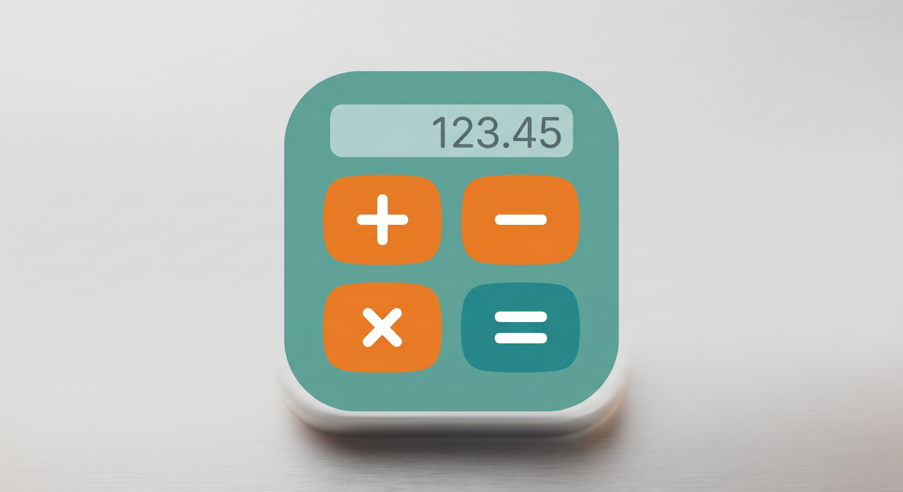

  

<h1 align="center">Ultimate Calculator</h1>

<h3 align="center">Full-featured math engine</h3>

  Solve complex math, finance, statistics, and daily conversions – easier than ever on your Android device.

  
  

<h2 align="center">Download</h2>

  

  <i>Requires Android 5.0 or higher.</i>

<h2 align="center">Features</h2>

<ul>
  <li>Local, offline step-by-step calculation engine.</li>
  <li>A configurable interface with multiple themes, button styles, and color accents.</li>
  <li>Category support: Algebra, Statistics, Finance, Geometry, Physics, Chemistry, and Developer tools.</li>
  <li>Pop-up modals for complex inputs (Matrices, BMI, EMI) without requiring syntax memorization.</li>
  <li>Light and dark themes, including a true AMOLED black mode.</li>
  <li>Smart history tracking to easily recall and edit previous calculations.</li>
  <li>Plus much more...</li>
</ul>

<h2 align="center">How to Use</h2>

<ul>
  <li><b>Access Categories:</b> Tap the <b>SCI 🔼</b> button on the main keypad to slide up the Advanced Category Drawer.</li>
  <li><b>Search or Browse:</b> Use the search bar to find a specific function, or tap a category icon (e.g., Matrix, Finance).</li>
  <li><b>Smart Modals:</b> Tapping a function will open a clean pop-up. Simply fill in your numbers in the labeled text boxes and hit <b>Calculate</b>.</li>
  <li><b>Step-by-Step Tape:</b> The calculation is processed in the background, and the step-by-step breakdown is instantly printed to your main display.</li>
</ul>

<h2 align="center">Supported Functions (144+)</h2>

<ul>
  <li><b>Algebra & Math:</b> Quadratic/Linear equations, Pythagoras, AP/GP, Combinatorics, GCD/LCM, Prime checkers, Base conversions, Bitwise operations.</li>
  <li><b>Statistics:</b> Mean, Median, Mode, SD, Variance, Percentiles, Linear Regression, Correlation.</li>
  <li><b>Linear Algebra:</b> 2x2 and 3x3 Determinants, Inverses, Matrix Math, Eigenvalues, Cramer's Rule.</li>
  <li><b>Finance:</b> Simple/Compound Interest, EMI, GST, Profit/Loss, Discount, CAGR, ROI, Break-Even Point.</li>
  <li><b>Science & Geometry:</b> Area/Volume formulas, Distance/Slope, Physics kinematics, Thermodynamics, Snell's Law, Molarity, pH/pOH, Ideal Gas Law, Radioactive Half-Life.</li>
  <li><b>Everyday Tools:</b> BMI, BMR, TDEE, Body Fat %, Age calculator, Date differences, 50+ Unit Converters.</li>
</ul>

<h2 align="center">Contributing</h2>

  <a href="#">Code of conduct</a> · <a href="#">Contributing guide</a>

  Pull requests are welcome. For major changes, please open an issue first to discuss what you would like to change.

  Before reporting a new issue, take a look at the <a href="#">FAQ</a>, the <a href="#">changelog</a> and the already opened <a href="#">issues</a>; if you got any questions, join our <a href="#">Discord server</a>.

<h2 align="center">Disclaimer</h2>

  The developer(s) of this application does not provide licensed financial, medical, or dietary advice. All health and finance calculations are estimates provided for informational and educational purposes only, and this application hosts zero external tracking.

<h2 align="center">License</h2>

<pre align="center">
Copyright © 2026 Ultimate Calculator Open Source Project

Licensed under the Apache License, Version 2.0 (the "License");
you may not use this file except in compliance with the License.
You may obtain a copy of the License at

http://www.apache.org/licenses/LICENSE-2.0

Unless required by applicable law or agreed to in writing, software
distributed under the License is distributed on an "AS IS" BASIS,
WITHOUT WARRANTIES OR CONDITIONS OF ANY KIND, either express or implied.
See the License for the specific language governing permissions and
limitations under the License.
</pre>
